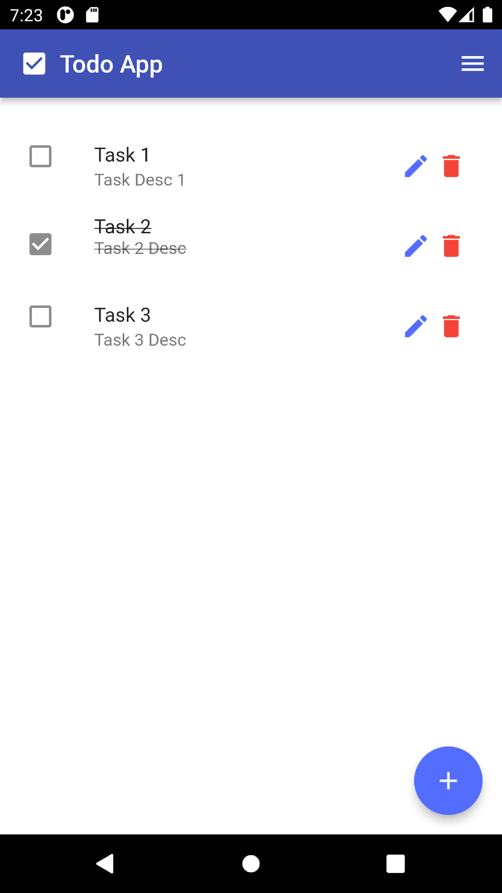
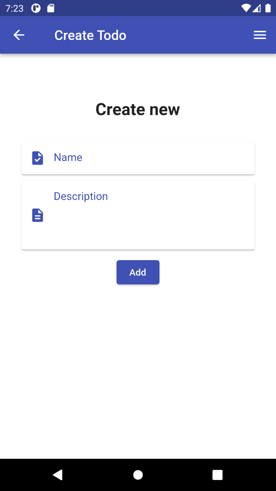
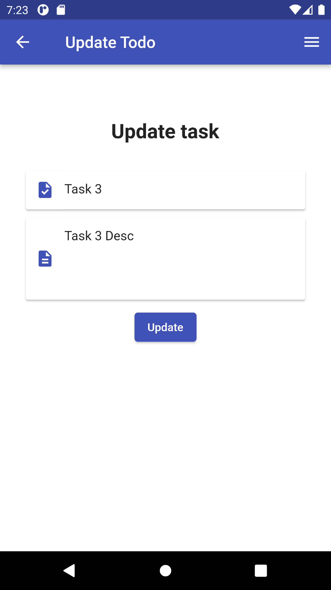
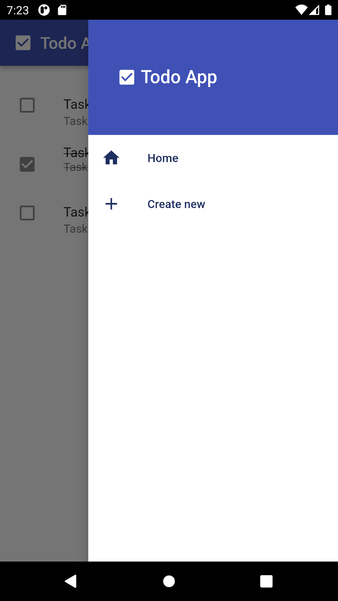

# flutter-todo
Flutter todo 

## this app built with Flutter
- You can add & update & delete tasks
- You can order your tasks
- Data saved for you after the app closing
- If you like this work you can <a href="https://github.com/akramghaleb">see more here</a>
 

| Home Screen | Create Screen |
| --- | --- |
|  |  |

| Update Screen | Menu Screen |
| --- | --- |
|  |  | 
